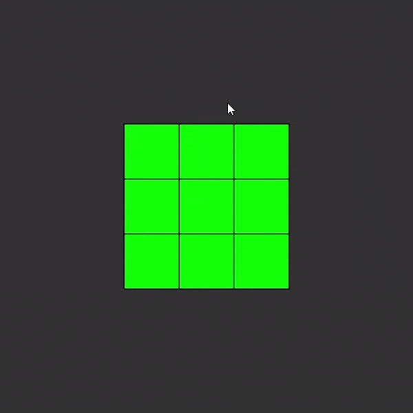
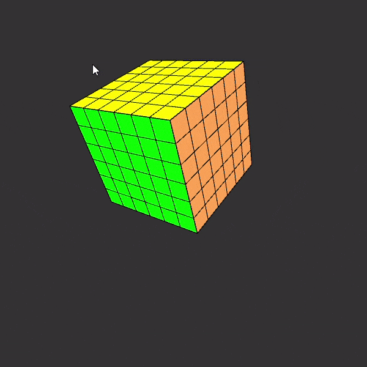

# RubixCube
RubixCube Simulation made in Processing.
- Works for any n-dimension cube.
- You can program it to execute a sequence of moves as in the gifs below.
- You can move the 6 faces plus the middle layer manually:
    - Note that lowercase letters denote CCW (counter-clockwise) rotation and uppercase denote CW (clockwise) rotation.
    -> Top: 'T' or 't'\n
    -> Down: 'D' or 'd'
    -> Left: 'L' or 'l'
    -> Right: 'R' or 'r'
    -> Front: 'F' or 'f'
    -> Back: 'B' or 'b'
    -> Middle: 'M' or 'm'

3x3x3 Demo:

6x6x6 Demo:

